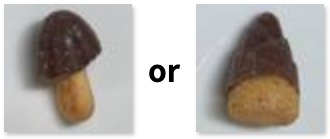

## [2. おすすめロードマップ](./02_roadmap.md)

### 最終到達目標を決める
- 例: 複数のきのこ・たけのこをリアルタイムに物体検出する

▼イメージ

### 上記の目標の前段階となる課題（比較的簡単な課題）を設定する
- 例: 1枚1個の画像から、きのこ・たけのこを分類する

### 比較的簡単な課題でFastAPIを実装する → 要件クリア
- Python開発環境構築
  - VS Code
  - 別途ハンズオンコースを実施予定
- FastAPIセクションの学習
- データ収集
- 機械学習モデル作成
- FastAPIの実装
- フロントエンドの実装【ステップアップ】

### 最終目標に向けてガンガン進める！
- 技術調査
- 実装
- 資料作成

### Done is better than perfect.
完璧を目指すより、まず終わらせよ

[▲TOP PAGE](./README.md)

2024@rockyhg (Hiroki Haga)
