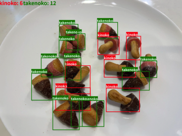

# [おすすめロードマップ](./02_roadmap.md)

## 1. 最終到達目標を決める
例: 複数のきのこ・たけのこをリアルタイムに物体検出する

## 2. 上記の目標の前段階となる課題（比較的簡単な課題）を設定する
例: 1枚1個の画像から、きのこ・たけのこを分類する

## 3. 比較的簡単な課題でFastAPIを実装する → 要件クリア
- Python開発環境構築
  - VS Code
  - 仮装環境 (venv)
- FastAPIセクションの学習
- データ収集
- 機械学習モデル作成
- FastAPIの実装
- フロントエンドの実装【ステップアップ】

## 4. 最終目標に向けてガンガン進める！
- 技術調査
- 実装
- 資料作成

## おわりに
「Done is better than perfect.」（マーク・ザッカーバーグ） 
→ 完璧を追求しすぎることで遅延するよりも、とにかくやり遂げて終わらせることの方が重要

- 完璧を求めすぎると、なかなか終わらないことが多いです。全ての細部にこだわりすぎることで、全体の進行が遅れてしまいます
- 完成させることで次のステップに進むことができます
- 小さな改善を繰り返す方が最終的には良い結果につながることが多いです

[▲TOP PAGE](./README.md)

2024@rockyhg (Hiroki Haga)
